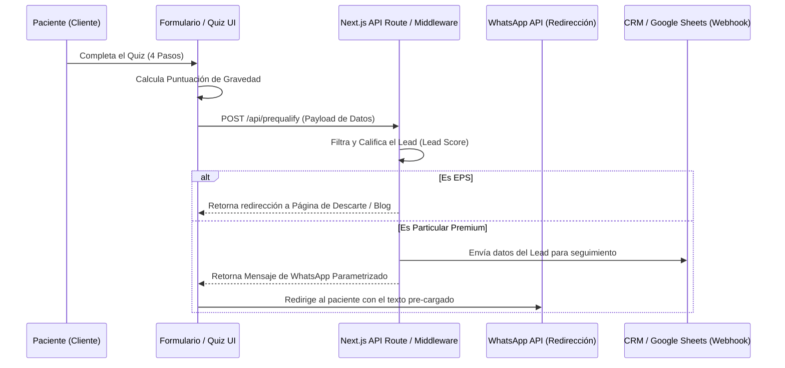

# MAPEO Y ESQUEMA DE DATOS (DATA MAPPING)
**Proyecto:** Nuevo Portal Web y Embudo de Conversión COE Caribe IPS  
**Estado:** Borrador Inicial  
**Fecha:** 12 de Junio, 2026  
**Autor:** Arquitecto de Datos / Desarrollador Principal  

---

## 1. Flujo de Datos del Embudo



---

## 2. Esquema de Datos del Lead (JSON Payload)

Cuando el cliente envía el formulario del Quiz, se envía un objeto JSON con la siguiente estructura:

```json
{
  "lead_id": "uuid-v4-string",
  "created_at": "2026-06-12T22:05:00Z",
  "patient_info": {
    "name": "Juan Pérez",
    "email": "juan.perez@example.com",
    "phone": "+573001234567"
  },
  "clinical_screening": {
    "symptoms": ["fatiga_postprandial", "dificultad_perder_peso", "ansiedad_dulce", "grasa_abdominal"],
    "diagnoses": ["resistencia_insulina", "higado_graso"],
    "severity_score": 8
  },
  "qualification": {
    "payment_agreement": true,
    "lead_status": "PREMIUM_CALIFICADO"
  }
}
```

---

## 3. Diccionario de Datos y Reglas de Validación

| Campo | Tipo | Validación / Restricciones | Descripción |
| :--- | :--- | :--- | :--- |
| `lead_id` | String (UUIDv4) | Requerido. Generado en cliente. | Identificador único del lead para tracking. |
| `created_at` | String (ISO 8601) | Requerido. Generado en cliente. | Fecha y hora exacta del envío. |
| `patient_info.name` | String | Requerido. Mínimo 3, máx 100 caracteres. Alfabeto y espacios. | Nombre completo del paciente. |
| `patient_info.email` | String | Requerido. Formato email válido. | Correo electrónico de contacto. |
| `patient_info.phone` | String | Requerido. Formato E.164 (ej. +57...). | Número celular/WhatsApp. |
| `clinical_screening.symptoms` | Array[String] | Requerido (mínimo 1 opción). | Lista de síntomas metabólicos seleccionados. |
| `clinical_screening.diagnoses`| Array[String] | Requerido (mínimo 1 opción). | Diagnósticos previos del paciente. |
| `clinical_screening.severity_score`| Integer | Calculado: Suma de pesos de síntomas y diagnósticos. | Puntuación interna para medir severidad metabólica (escala 0-10). |
| `qualification.payment_agreement`| Boolean | Requerido. Debe ser `true` para flujo premium. | Indica si el usuario acepta tarifas de consulta particular privada. |
| `qualification.lead_status`| String | Enum: `["PREMIUM_CALIFICADO", "EPS_FILTRADO"]` | Estado del lead para el enrutamiento. |

---

## 4. Lógica de Puntuación de Gravedad (Lead Score)

Para dar prioridad a los leads con mayor riesgo clínico de comorbilidades metabólicas en el CRM, se asignan los siguientes pesos:

*   **Síntomas (+1 punto c/u):**
    *   `fatiga_postprandial` (Cansancio crónico tras comer).
    *   `dificultad_perder_peso` (Incapacidad de bajar peso corporal).
    *   `ansiedad_dulce` (Ansiedad incontrolable por carbohidratos).
    *   `grasa_abdominal` (Perímetro abdominal aumentado).
*   **Diagnósticos Clínicos (+2 puntos c/u):**
    *   `resistencia_insulina` (Resistencia a la insulina diagnosticada).
    *   `higado_graso` (Esteatosis hepática diagnosticada).
    *   `prediabetes` / `diabetes_t2` (Alteración en glucemia o diabetes declarada).
    *   `hipertension_arterial` (Presión arterial elevada).

### Matriz de Prioridad en CRM:
*   **Score >= 6:** Prioridad Alta (Paciente metabólico complejo). Agendamiento inmediato.
*   **Score 3 - 5:** Prioridad Media (Sobrepeso/Síntomas moderados).
*   **Score <= 2:** Prioridad Baja (Interés generalista o estético).
