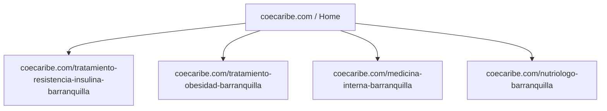
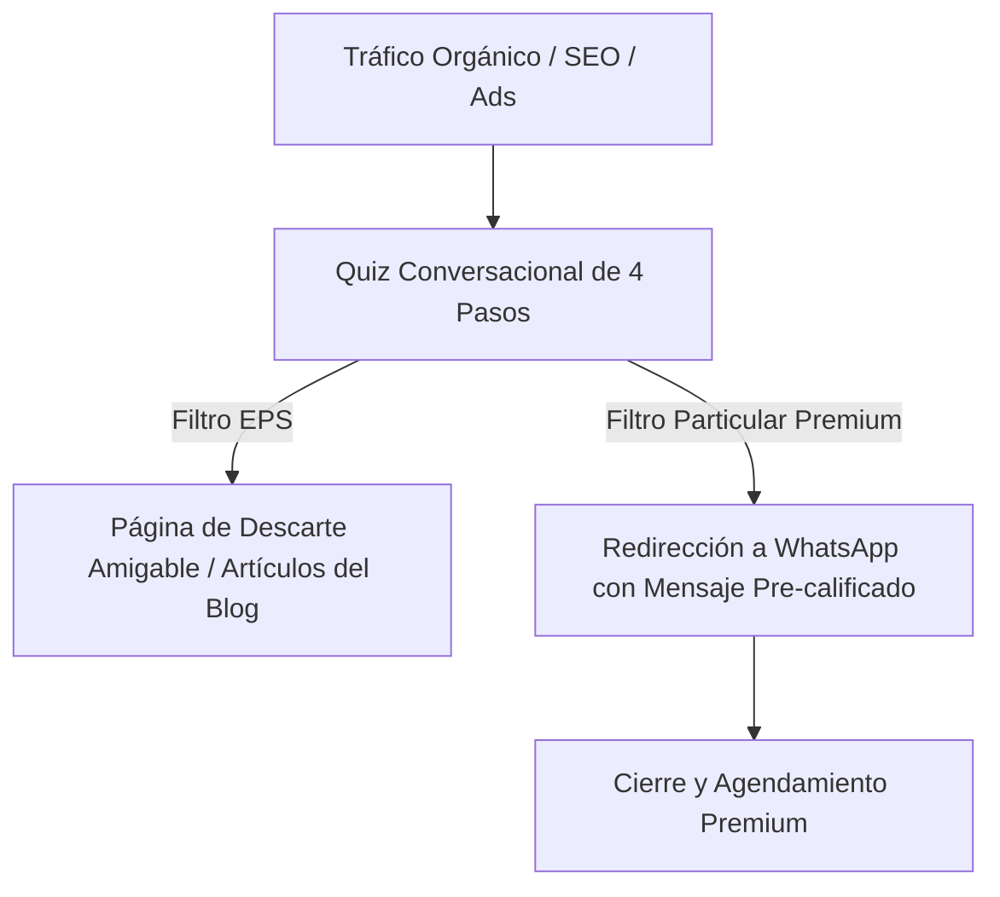

# PLAN ESTRATÉGICO DE MARKETING DIGITAL Y CRO: COE CARIBE IPS
**Enfoque:** Captación de Pacientes Premium con Comorbilidades Metabólicas en Barranquilla, Colombia  
**Elaborado por:** Equipo Consultor de Marketing Digital Médico (SEO Local, Copywriting Clínico y CRO)  
**Fecha:** 12 de Junio, 2026

---

## 1. REESTRUCTURACIÓN SEO LOCAL EN SILOS Y TRANSPARENCIA DE PAGO
El paciente premium en Barranquilla (habitante de estratos 5 y 6 en zonas como Riomar, Altos de Riomar o El Golf) realiza búsquedas específicas cuando siente que su salud metabólica corre peligro. Agrupar todos los servicios en una sola URL genérica (`/servicios`) diluye la relevancia en buscadores.

### Acciones de SEO Local y On-Page:
1.  **Creación de Landing Pages de Especialidad Local:** Diseñar páginas exclusivas para intenciones de búsqueda transaccional como *"tratamiento de resistencia a la insulina barranquilla"*, *"medico internista barranquilla particular"* o *"nutricionista clinica barranquilla"*. Cada página debe contar con el marcado de datos estructurados Schema (`@type: MedicalBusiness` y `FAQPage`).
2.  **Optimización en Google Business Profile (GBP):**
    *   Cambiar el nombre de la ficha a: `COE Caribe | Clínica de Obesidad y Salud Metabólica`.
    *   Configurar categorías: Categoría principal `Clínica médica` (Medical Clinic), y secundarias: `Médico de medicina interna`, `Nutricionista` y `Servicio de pérdida de peso`.
    *   Unificar el NAP (Name, Address, Phone) exactamente en todas las plataformas digitales: `Carrera 50 # 76-54 Local 2, Barranquilla, Atlántico, 080020`.
3.  **Reencuadre Exclusivo de la Consulta Particular:** En las landing pages y FAQs, transformar la limitación de no atender EPS en una propuesta de valor premium:
    > *"En COE Caribe ofrecemos un abordaje 100% privado y particular. Esto nos permite garantizar consultas extendidas de 45 a 60 minutos con nuestros especialistas y un seguimiento digital continuo, algo imposible bajo las limitaciones de tiempo del sistema de aseguradoras tradicionales."*

---

## 2. MENSAJE CLÍNICO DE CO-MANEJO Y AUTORIDAD CIENTÍFICA
El paciente de alto valor que sufre de diabetes tipo 2, hígado graso severo o hipertensión descontrolada busca **salvar su vida y evitar eventos cardiovasculares (infartos, ACV)**. El mensaje actual centrado en la "obesidad" y la "cercanía" evoca un centro de estética o control de peso superficial, lo que atrae a leads de bajo costo y ahuyenta al paciente metabólico complejo.

### Acciones de Posicionamiento y Copywriting:
1.  **Rediseño de la Hero Section (Home):**
    *   *Antes (Generalista):* `"Clínica de Obesidad y Metabolismo en Barranquilla. Más que un tratamiento, en COE Caribe te brindamos apoyo, ciencia y cercanía..."`
    *   *Después (Premium y Científico):* 
        *   **H1:** `Revierta su disfunción metabólica con ciencia médica, no con restricciones.`
        *   **Subtítulo:** `En COE Caribe integramos la Medicina Interna y la Nutrición Clínica Avanzada para tratar la raíz de la diabetes, el hígado graso y el riesgo cardiovascular. Recupere su vitalidad y proteja sus órganos blanco con protocolos de nivel internacional.`
        *   **CTA:** `Solicite un Diagnóstico Metabólico de Precisión`
2.  **La Sinergia Clínica como Estándar de Oro:** Destacar de manera explícita en la web el co-manejo multidisciplinario:
    *   **Dr. Antony Molina (Médico Internista - WOF):** Evalúa el eje Cardiovascular-Renal-Metabólico (CKM), optimiza la farmacoterapia de última generación (GLP-1) y previene fallas orgánicas.
    *   **Dra. Junieth Meriño (Médico Nutrióloga):** Diseña la terapia nutricional de precisión celular que desinflama el cuerpo y restaura la sensibilidad a la insulina.
    *   *Mensaje de Sinergia:* *"En COE Caribe su caso es co-manejado en tiempo real por un internista y una nutrióloga clínica. No trabajamos en islas."*
3.  **Estructura de Programas de Salud de Alto Valor (High-Ticket):** Dejar de vender "citas individuales" y migrar hacia programas cerrados de 12 a 24 semanas:
    *   *Protocolo de Remisión de Resistencia a la Insulina y Diabetes Tipo 2* (incluye sensor de monitoreo continuo de glucosa - CGM).
    *   *Programa de Restauración Hepática* (reversión de hígado graso grado I-III).
    *   *Programa de Optimización Cardiometabólica* (control de riesgo cardiovascular y dislipidemia).

---

## 3. EMBUDO CONVERSACIONAL DE PRECALIFICACIÓN Y CONFIANZA MÉDICA (CRO)
La principal fuga de conversión y pérdida de tiempo comercial en COE Caribe proviene del redireccionamiento directo a WhatsApp, donde el equipo se satura atendiendo solicitudes no calificadas (personas buscando EPS o servicios de bajo costo).

### Acciones de Optimización del Embudo (CRO):
1.  **Implementación del "Diagnosticador de Salud Metabólica":** Un cuestionario interactivo multi-paso en la landing page:
    *   *Paso 1 (Gravedad):* Selección de signos experimentados (fatiga crónica, triglicéridos altos, incapacidad de perder grasa visceral).
    *   *Paso 2 (Historial):* Diagnóstico médico previo (prediabetes, diabetes, hígado graso).
    *   *Paso 3 (Filtro de Modelo de Pago):* *"Nuestros protocolos son 100% particulares y no trabajamos con EPS para asegurar la máxima calidad. ¿Está de acuerdo con este modelo de atención? [Sí, busco atención privada premium / No, prefiero EPS]"*.
    *   *Paso 4 (Captura de WhatsApp y Nombre):* El lead calificado es redirigido a WhatsApp con un mensaje pre-cargado detallando sus síntomas y aceptando los términos de consulta particular.
2.  **Manejo Ético y Premium de Casos de Éxito (Alternativa al Antes/Después):**
    El código de ética médica colombiano (Ley 23 de 1981) y la SIC restringen la publicidad médica sensacionalista o promesas de resultados. En su lugar, se propone crear **Casos de Estudio Clínicos Anonimizados**:
    *   *Estructura de Ficha Clínica:*
        *   **Paciente:** Femenina, 47 años, con resistencia a la insulina severa y obesidad grado I.
        *   **Situación Inicial:** HOMA-IR en 6.4, fatiga diurna inhabilitante, grasa visceral de alto riesgo.
        *   **Protocolo COE:** 16 semanas de terapia nutricional de precisión + monitoreo continuo de glucosa + optimización médica interna.
        *   **Evolución Documentada:** Reducción del HOMA-IR a 2.1, remisión completa de la fatiga, pérdida de 12 kg de grasa corporal y reducción médica supervisada de fármacos.
    *   *Efecto:* Transmite un rigor científico excepcional, ideal para captar al paciente premium, a la vez que cumple con las regulaciones vigentes en Colombia.

---

> [!NOTE]
> Este plan estratégico está diseñado para ser implementado en un plazo de 90 días, unificando esfuerzos técnicos de desarrollo en Next.js, SEO local y rediseño de copywriting clínico.
