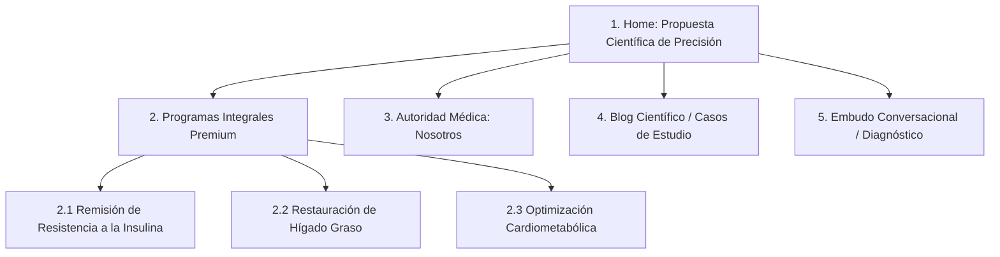

# HOJA DE RUTA: CREACIÓN DESDE CERO DEL NUEVO SITIO WEB DE COE CARIBE
**Fase de Rebranding e Inicialización de Proyecto**

Para construir un sitio web desde cero con una **intención clara, definitoria y alineada a pacientes metabólicos premium**, no debemos empezar programando ni diseñando layouts al azar. Necesitamos establecer una estructura base dividida en 5 pilares fundamentales:

---

## PIlar 1: Definición del Posicionamiento Clínico (La "Intención" de Marca)
Antes de la primera línea de código, la marca debe responder de forma unificada a estas tres preguntas:
1.  **¿Quién es nuestro paciente ideal?** (No es "quien quiera adelgazar"; es la persona con disfunción metabólica, hígado graso o prediabetes/diabetes que busca soluciones científicas y personalizadas).
2.  **¿Cuál es la promesa única de valor?** (Reversión metabólica y protección de órganos mediante el co-manejo coordinado de Medicina Interna + Nutriología Avanzada).
3.  **¿Cómo justificamos el modelo particular?** (Tiempo de consulta, tecnología diagnóstica de precisión y acompañamiento diario).

---

## Pilar 2: Arquitectura de la Información (Sitemap de Conversión)
El sitio no debe estructurarse por "especialidades aisladas", sino por "soluciones a patologías". 



---

## Pilar 3: Guía de Estilo Visual (Digital Design Tokens)
Para proyectar prestigio y rigor científico, el rebranding visual en la web debe utilizar un sistema de diseño limpio, moderno y con altos contrastes.

### Propuesta de Paleta de Colores (Tokens CSS):
*   **Color Primario (Confianza Médica):** Azul marino profundo (ej. `#0F172A` o HSL afinados) que proyecta rigor, autoridad y seriedad clínica.
*   **Color Secundario (Salud y Vitalidad):** Verde esmeralda o salvia apagado (ej. `#10B981`) que representa regeneración celular y metabolismo activo.
*   **Acento (Premium):** Toques sutiles de oro cálido o arena (ej. `#D97706`) para elementos transaccionales seleccionados (CTAs principales, insignias de membresías científicas).
*   **Tipografías:**
    *   *Títulos (H1, H2, H3):* Sans-serif estructurada (ej. **Outfit** o **Playfair Display** para un toque más clínico e histórico).
    *   *Cuerpo:* Altamente legible y moderna (ej. **Inter** o **Plus Jakarta Sans**).

---

## Pilar 4: Configuración del Stack Tecnológico (Tech Stack)
Para una clínica médica premium, la velocidad, el SEO técnico y la seguridad son innegociables.
1.  **Framework:** **Next.js (App Router)**. Permite renderizado del lado del servidor (SSR) para indexar de inmediato los artículos científicos del blog, y carga ultra rápida para evitar rebote de usuarios.
2.  **Estilos:** **Vanilla CSS** con variables personalizadas (Design Tokens) o **TailwindCSS** (si se prefiere agilidad de desarrollo), asegurando consistencia visual en cada componente.
3.  **Marcado Estructurado (JSON-LD):** Configurado desde el día uno para que Google entienda que es una IPS real y localice geográficamente los perfiles de los doctores.

---

## Pilar 5: El Embudo de Conversión de Entrada (Lead Capture)
El sitio web nuevo no debe tener botones flotantes de WhatsApp genéricos en todas las esquinas. La principal llamada a la acción (CTA) debe ser un **Quiz de Precalificación Metabólica**.
*   **Propósito:** Calificar la severidad de los síntomas, educar al usuario sobre el costo particular de la consulta, y direccionar únicamente a leads altamente calificados al equipo comercial, ahorrando horas de atención al cliente.

---

## ROADMAP DE INICIO INMEDIATO (¿Qué hacemos ahora?)

```markdown
1. [ ] Definir la paleta final de colores (Rebranding) y tipografías.
2. [ ] Redactar el sitemap definitivo y los textos de los 3 programas principales.
3. [ ] Inicializar el repositorio de Next.js en limpio.
4. [ ] Crear la estructura de carpetas modular (components, layouts, styles).
5. [ ] Diseñar y codificar el prototipo del Quiz de Precalificación Metabólica.
```
